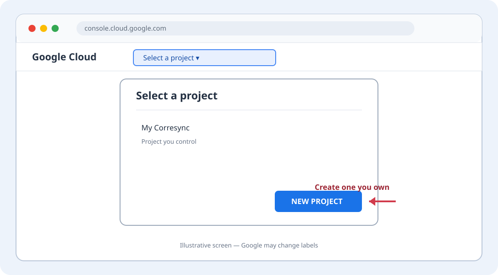
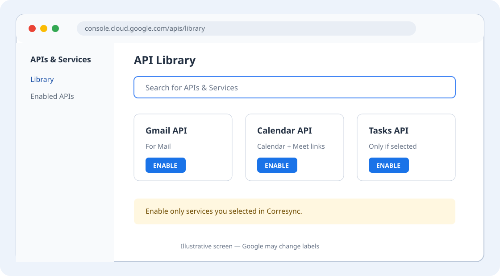
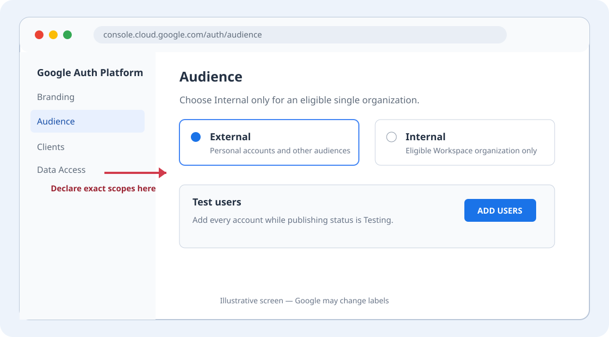
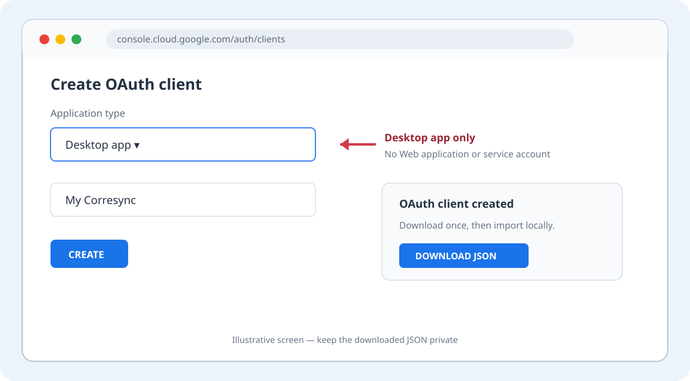

# Connect Google with your own OAuth client

Corresync can connect Gmail, Google Calendar, Google Meet links, and Google
Tasks with a Desktop OAuth client in a Google Cloud project you control.
Corresync-managed Google OAuth is not active. Creating your own client keeps
the Cloud project, consent-screen identity, quota, and authorization decision
with you and avoids depending on Corresync's future public-app review.

This is still ordinary Google OAuth: the system browser owns sign-in, account
selection, MFA, warnings, organization policy, and consent. Corresync never
asks for your Google password or cookies. It stores the generated Desktop
client credential and the later OAuth grant in your OS keyring, under separate
handles.

The diagrams below are annotated guides, not captured account data. Google may
adjust labels; follow the linked official page if a screen has moved.

## Before you start

You need:

- a Google account you already control;
- permission to create a Google Cloud project, or an existing project you are
  authorized to use;
- Corresync installed on the same computer where you will sign in; and
- for a managed Workspace account, any approval your administrator requires.

Google says verification is not mandatory for personal-use apps with fewer
than 100 users or for qualifying internal-use apps, though an unverified-app
warning, user cap, organization policy, and other limits may still apply.
Projects left in **Testing** accept only listed test users, and those test-user
authorizations expire after seven days. Read Google's current
[verification exemptions](https://support.google.com/cloud/answer/13464323?hl=en)
and [audience rules](https://support.google.com/cloud/answer/15549945?hl=en)
before choosing a publishing status.

## 1. Create or select your Cloud project

Open the [Google Cloud Console](https://console.cloud.google.com/), use the
project picker in the top bar, and create or select a project you own. A name
such as “My Corresync” makes the consent screen recognizable. Do not use a
shared project unless its owner has explicitly authorized this use.



## 2. Enable only the APIs you selected

Open **APIs & Services → Library** and enable:

| Corresync service | Google API |
| --- | --- |
| Gmail | Gmail API |
| Calendar and Google Meet event links | Google Calendar API |
| Tasks | Google Tasks API |

Do not enable Google Chat, Drive, Contacts, or administrative APIs for
Corresync. Google's official
[Workspace API guide](https://developers.google.com/workspace/guides/enable-apis)
describes the current enablement flow.



## 3. Configure Google Auth Platform

Open **Google Auth Platform** for the same project.

1. Under **Branding**, enter an app name you recognize, a support email you
   control, and the required contact information. You do not need to claim the
   Corresync trademark or use the Corresync website for a personal client.
2. Under **Audience**, choose **Internal** only when the project and every
   account you will connect belong to the same eligible Workspace organization.
   Otherwise choose **External**. If the app stays in Testing, add every Google
   account you will connect as a test user.
3. Under **Data Access**, declare only the scopes for services you will select:

   ```text
   https://www.googleapis.com/auth/gmail.modify
   https://www.googleapis.com/auth/calendar.calendarlist.readonly
   https://www.googleapis.com/auth/calendar.events
   https://www.googleapis.com/auth/tasks.readonly
   https://www.googleapis.com/auth/tasks
   ```

   Mail uses `gmail.modify`; it does not use Gmail's permanent-delete method.
   Calendar uses the two calendar scopes. A read-only Tasks route uses
   `tasks.readonly`; a writable Tasks route uses `tasks`, never both. Corresync
   derives the exact subset again at login and shows it before opening Google.



If your organization blocks the client, stop and ask its administrator. Do not
change to a service account, domain-wide delegation, a different account, or a
weaker security control to get around policy.

## 4. Create a Desktop OAuth client and download it

Open **Google Auth Platform → Clients**, select **Create client**, choose
**Desktop app**, give it a local name, and create it. A Desktop app needs no
public web callback. Corresync uses Google's recommended IPv4 loopback flow on
macOS, Linux, and Windows with a new random local port for each authorization.

Download the JSON immediately and keep it private. Use the official
[Manage OAuth Clients](https://support.google.com/cloud/answer/15549257?hl=en)
and [Desktop OAuth](https://developers.google.com/identity/protocols/oauth2/native-app)
pages if the screen differs.



The file must contain an `installed` client. Do not use a Web application,
service-account key, Android/iOS client, API key, or a JSON file from another
application.

## 5. Let guided setup import it

Run:

```console
corr setup
```

Enter the account address, select the Google route, choose the services you
want, and select **Import downloaded client JSON**. Review the file path,
client ID, loopback URI, grant handles, and scopes. Account creation still does
not authenticate. At the handoff, choose **Store the downloaded OAuth client
securely**; only then choose **Sign in now in Google's browser**.

For a scripted setup, import first:

```console
corr auth google-client import ~/Downloads/client_secret.json \
  --key personal-google-client
corr account add you@example.com --alias personal --provider google \
  --oauth-client-id YOUR_CLIENT_ID.apps.googleusercontent.com \
  --oauth-redirect-uri http://127.0.0.1:0 \
  --authorization-key personal-google \
  --approve-oauth \
  --oauth-client-secret-key personal-google-client \
  --approve-oauth-client-secret
corr auth login --account personal
```

Import is create-only. If the handle exists, choose another one. Use
`--replace` only when intentionally rotating the same Google client credential;
do not replace a handle used for an IMAP, SMTP, CalDAV, or other credential.

Use `--mail-provider none --calendar-provider google` for Calendar only. Use
`--calendar-provider none` for Gmail only. Google Tasks is a separate service
choice and authorization; guided setup is safer than composing its advanced
flags manually.

After import, move or delete the downloaded JSON using your operating system's
normal secure file-management practice. Corresync deliberately does not delete
an explicit input file. Never paste its client credential into config, a shell
command, MCP input, an issue, logs, or support output.

## 6. Confirm the result

```console
corr doctor --account personal
corr auth status --account personal
corr mail folders --account personal
corr calendar folders --account personal
```

`doctor` reports the configured scopes without starting OAuth. MCP can use an
already authenticated session but cannot create a Google authorization. A
fresh or expanded grant always requires explicit local CLI login.

## Common problems

<!-- markdownlint-disable MD013 -->

| Message or symptom | What to check |
| --- | --- |
| “Access blocked” or an admin-review screen | The Workspace administrator controls third-party app access. Ask them to review your exact client ID and scopes. |
| “Error 403: access_denied” in Testing | Add the account under **Audience → Test users** in the same project. |
| Sign-in stops working every seven days | Testing authorizations expire after seven days. Reauthorize, or review whether Google's personal/internal production exemption fits your use. |
| “redirect_uri_mismatch” | Recreate or select a **Desktop app** client. Do not use a Web application client. Keep the Corresync URI at `http://127.0.0.1:0`. |
| API reports it is disabled | Enable Gmail API, Google Calendar API, or Google Tasks API in the same project as the client. |
| Client credential not found | Re-run `corr auth google-client import FILE --key HANDLE` with the handle printed by the original import or recorded in the private `corr config show --json` view. Do not paste that output into support channels. |
| Scope changed | Run `corr doctor`, review the new exact scope set, then explicitly run `corr auth login` again. Corresync never widens a grant silently. |

<!-- markdownlint-enable MD013 -->

## Recover a legacy Google route

Schema versions 3 through 10 had no separate, consented Desktop-client
credential reference. Corresync refuses to invent that authority, leaves the
file unchanged, and cannot load it through `setup` or `config edit` until the
legacy route is removed manually.

1. Run `corr daemon stop`, then `corr config path` to identify the exact file.
2. Make a private backup of that file.
3. In a text editor, remove the complete `[accounts.ALIAS]` tree for every
   account named by the migration error. Removing the whole affected account
   avoids retaining a mixed or partially authorized route.
4. If the removed alias was `default_account`, set `default_account` to another
   remaining alias, or to an empty string when no accounts remain.
5. Run `corr setup` and add the account and each wanted service again. Review
   and import your own Desktop client through the current flow.

Do not copy an old grant, token, client credential, consent bit, or account ID
into the new route. Keep the backup only until the rebuilt account validates
and signs in, then dispose of it using your normal secure-file practice.

To revoke access, use your Google Account's third-party connections page and
then run `corr auth logout --account personal`. Removing the Corresync account
purges its unshared Corresync-owned OAuth grant and local account state; it does
not delete your externally owned Desktop client credential or Cloud project.

## Evidence status and future managed OAuth

The API adapters and this route have synthetic contract coverage. They remain
**live-unobserved** until an opt-in observation is recorded against the exact
revision. Provider policy and account capabilities can still differ after
sign-in.

The dormant Corresync-managed OAuth path is kept separate for a future review
or policy change. It is not an automatic fallback, capability probe, or hidden
switch, and it cannot take over a user-owned account route.
